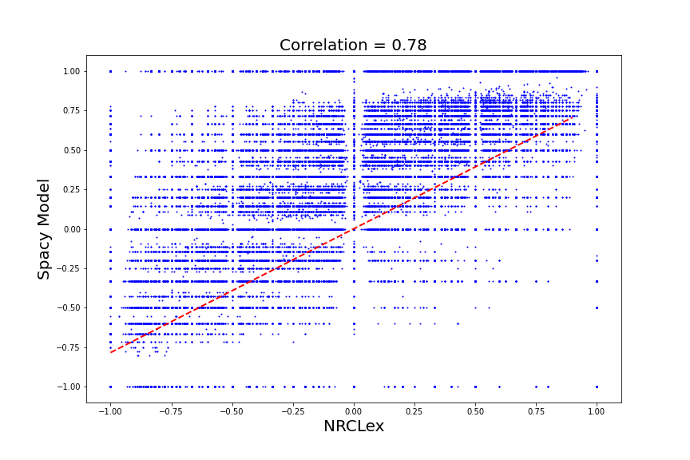
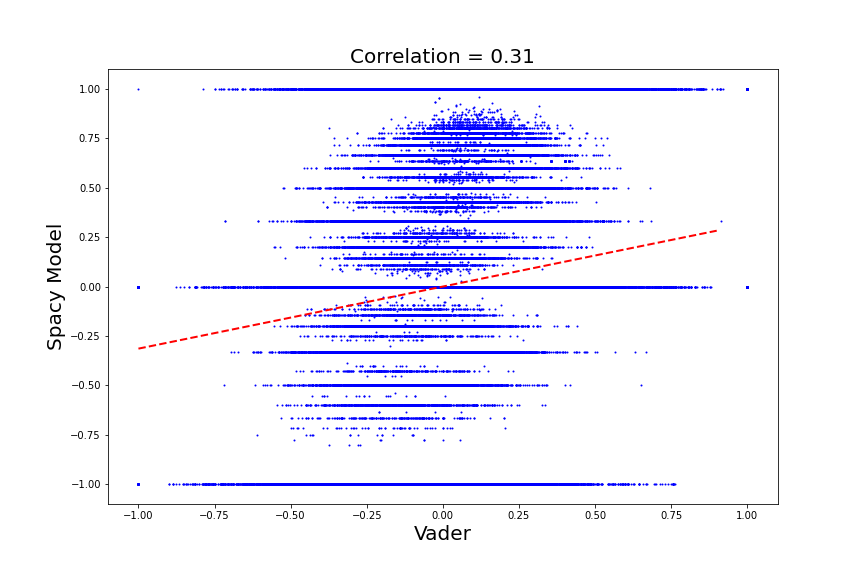

# Spacy Affect Model

## Background
This repository contains a Spacy model that measures emotional affect.  Several models exist that measure sentiment generally as a polarity score between -1.0 and 1.0; however, there are few options for measuring specific emotional content.  This machine learning model is built on a Spacy entity recognition framework, where the entity types refer to different emotional states (e.g., fear, anger, anticipation, trust, surprise, positive, negative, sadness, disgust, and joy).  These emotional states (affects) are derived from the (C) 2016 National Research Council Canada (NRC) Word-Emotion Association Lexicon.[^1] The model performance was correlated with the Natural Language Toolkit (NLTK) Valence Aware Dictionary and sEntiment Reasoner (vader) algorithm.[^2] Model performance was also compared with the NRCLex affect measurement algorithm.[^3] 

While the NRCLex algorithm is relatively easy to deploy and appears to be useful[^4], it is not technically a machine learning tool.  It contains a dictionary of words and their associated affects.  From this, it measures affect frequencies as a proportion of identified affective words, and thus effectively acts as an overtrained model.  Theoretically, an entity recognition model could be used as a framework to overcome this limitation and may produce a model that can interpolate new affective words.

## Methdology
#### Training Data
The emotional states from the NRC lexicon were reformatted into a list of tuples containing each word (entity) and its associated emotion (entity type).  To build the training set, a set of news articles was collected using the NewsAPI news aggregator[^5].  The news text was tokenized into sentences, and sentences that did not contain entities from the NRC lexicon were removed from the raw dataset.  The Spacy text spanner was then used to generate a set of phrases and their associated entities for the required training dataset format prior to binary conversion.  The training data was split into a 60% training set and a 40% validation set. The entire collection of entity-containing sentences and the training dataset are too large for GitHub, but can be provided upon request.

#### Model Comparison
To assess the utility of the model, its performance was compared to that of the vader sentiment analyzer and the NRCLex library.  Model outputs were all normalized to scores between -1.0 and 1.0.  For the vader scores, the reported metric was calculaated as the positive polarity score minus the negative polarity score.  The Spacy model output and the NRCLex model output were both dictionaries containing affect frequencies.  Thus, the sum of the "positive" affects (anticipation, trust, surprise, positive, joy) was used as a proxy for the positive polarity, and the sum of the "negative" affects (fear, anger, negative, sadness, disgust) was used analogously.  Like the vader score, the difference of the positive polarity and the negative polarity was used for comparison.  New news articles were collected as described in the above section and sentiment and affect scores were calculated for each sentence using each model.  The scores were plotted and correlation coefficients were calculated. 

## Results
#### Training
Overall, a total of 3,151,100 sentences containing NRC lexicon entities were collected.  Of these, 700,000 were randomly selected for use in the training model (simply due to compute limitations).  At the end of the training run, the final precision and recall scores were 76.36 and 76.39, respectively.

#### Model Performance Relative to NRCLex and Vader
A total of 519,795 sentences were analysed by each model as described in the above section.  Overall, there was a high positive correlation (.78) between the Spacy model and the NRCLex algorithm.  Additionally, there were low positive correlations between the NRCLex model and the vader sentiment analyser (.35), and between the Spacy model and the vader sentmient analyzer (.31). The model comparisons are shown in the figures below.  

 
 
 

## Conclusion
Overall, the Spacy model performance is highly and positively correlated with the performance of the NRCLex algorithm.  This suggests that the models will perform similarly.  The benefit to using the Spacy model over the NRCLex algorithm is that the Spacy model is able to interpolate new affective words and thus it has more versatility than the NRCLex algorithm, which can only identify affective words that already exist within its dataset.

## Notes
An example script for deploying the Spacy model can be found in `example.py`.

#### References
[^1]: National Research Council Canada, *NRC Emotion Lexicon*, http://saifmohammad.com/WebPages/NRC-Emotion-Lexicon.htm.
[^2]: C.J. Hutto (@cjhutto), *VADER-Sentiment-Analysis*, https://github.com/cjhutto/vaderSentiment
[^3]: Mark M. Bailey (@metalcorebear), *NRCLex*, https://github.com/metalcorebear/NRCLex
[^4]: GeeksForGeeks, *Emotion classification using NRC Lexicon in Python*, https://www.geeksforgeeks.org/emotion-classification-using-nrc-lexicon-in-python/
[^5]: *News API*, https://newsapi.org/